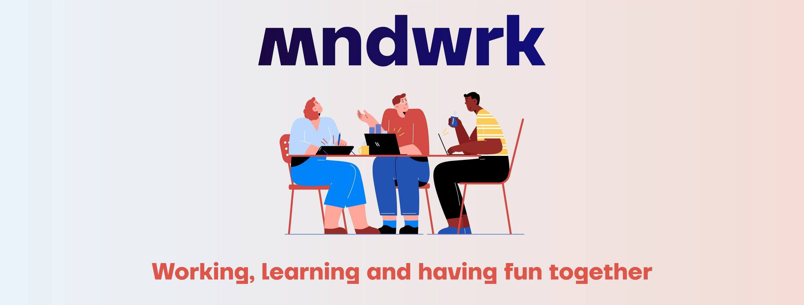
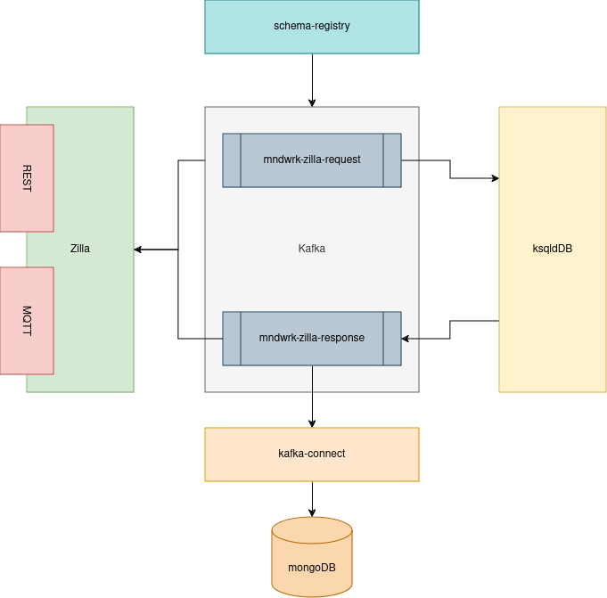

# MNDWRK Kafka Webinar


Welcome to the MNDWRK webinar demo repository! In this webinar, we'll explore the powerful Kafka ecosystem in conjunction with Spring Boot, showcasing how to build scalable, event-driven applications with ease.
we'll demonstrate the integration of Kafka, a distributed streaming platform, with Spring Boot, a popular Java framework for building microservices. Through practical examples, we'll illustrate how Kafka facilitates real-time data processing and messaging within an application ecosystem.

[`#kafka`](#) [`#kstreams`](#) [`#ksqldb`](#) [`#connect`](#) [`#schema-registry`](#) [`#zilla`](#)

## Webinar links

 - [Apache Kafka Ecosystem](https://www.mndwrk.com/events/digitalk-webinar-apache-kafka-ecosystem)

## Getting started

#### Architecture



#### Docker

```sh
docker-compose up -d

docker exec -it  mndwrk-webinar-kafka-demo-broker-1 /bin/bash

kafka-console-producer --topic webinar-demo-inbound --bootstrap-server localhost:9092
```

#### Payload

```json
{"source": "TLC", "description":"Green signal"}
```

```json
{"source": "CCTV", "description":"People detected"}
```

```json
{"source": "SENSOR", "description":"Something happend"}
```

```sh
kafka-console-consumer --topic webinar-demo-outbound --bootstrap-server localhost:9092
```

#### Restart Broker

```sh
sudo docker-compose down -v && sudo docker-compose up -d
```

#### Install MongoDB connector
```sh
confluent-hub install --no-prompt /data/connect-jars/mongodb-kafka-connect-mongodb-1.12.0.zip
```

#### Register Schema
```sh
curl -X POST -H "Content-Type: application/vnd.schemaregistry.v1+avro" -d@schemas/avro/zilla-request.avsc http://localhost:8081/subjects/mndwrk-zilla-request-value/versions | jq

jq '. | {schema: tojson}' schemas/avro/zilla-request.avsc  | \
    curl -X POST http://localhost:8081/subjects/mndwrk-zilla-request-value/versions \
         -H "Content-Type:application/json" \
         -d @-
jq '. | {schema: tojson}' schemas/avro/zilla-response.avsc  | \
    curl -X POST http://localhost:8081/subjects/mndwrk-zilla-response-value/versions \
         -H "Content-Type:application/json" \
         -d @-
```

#### ksqlDB
```sh
docker exec -it ksqldb-cli ksql http://ksqldb-server:8088
```

```sql
SET 'auto.offset.reset' = 'earliest';
```

```sql
CREATE OR REPLACE STREAM MNDWRK_ZILLA_REQUEST(UUID VARCHAR KEY) WITH (KAFKA_TOPIC='mndwrk-zilla-request', KEY_FORMAT='KAFKA', PARTITIONS=1, VALUE_FORMAT='AVRO');
```

```sql
SELECT `uuid`, `source`, `description`, TIMESTAMPTOSTRING(ROWTIME, 'yyyy-MM-dd HH:mm:ss.SSS') as `detectedAt` FROM MNDWRK_ZILLA_REQUEST EMIT CHANGES;
```

```sql
CREATE OR REPLACE STREAM MNDWRK_ZILLA_RESPONSE WITH (KAFKA_TOPIC='mndwrk-zilla-response', KEY_FORMAT='KAFKA', PARTITIONS=1, VALUE_FORMAT='AVRO') AS SELECT UUID as `uuid`, SOURCE as `source`, DESCRIPTION as `description`, TIMESTAMPTOSTRING(ROWTIME, 'yyyy-MM-dd HH:mm:ss.SSS') as `detectedAt` FROM MNDWRK_ZILLA_REQUEST EMIT CHANGES;
```

#### Connection via MQTT
```sh
mqtt pub -d -h localhost -p 61616 -v -t mndwrk-zilla-request -m:file ./payload.mqtt
```
```sh
mqtt sub -d -v -J -h localhost -p 61616 -i webinar-client -t mndwrk-zilla-response
```

#### Other

```sql
DROP STREAM IF EXISTS <stream_name> DELETE TOPIC;
DROP TABLE IF EXISTS <table_name> DELETE TOPIC;
EXPLAIN | DESCRIBE;
```

##

Project by Timot Tarjani [(@ttimot24)](https://github.com/ttimot24)